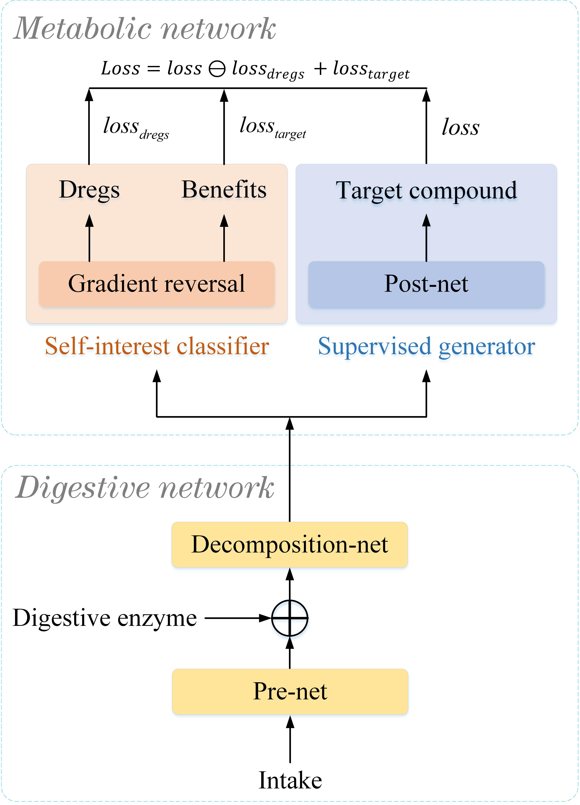
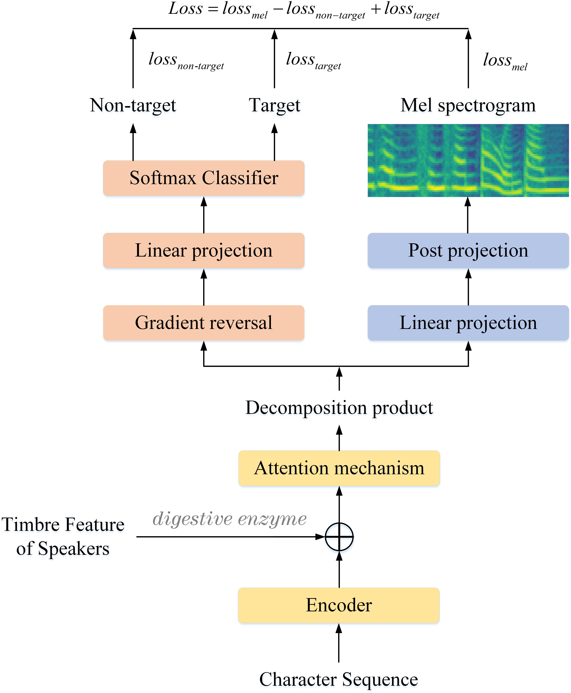
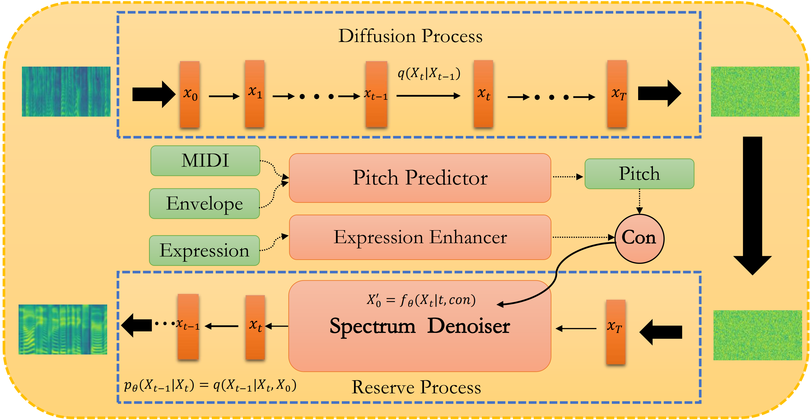

We show the demo of DiffBeautifier:Fast Diffusion Model for High-Fidelity Singing Voice Beautifying

## Overview

Singing voice beautifying (SVB) is a novel task that is widely used in practical scenarios. SVB task aims to correct the pitch of the singing voice and improve the expressiveness without changing the timbre and content. The major challenge of SVB is that paired data of professional songs and amateur songs is hard to obtain and we solved it for the first time. In this paper, we propose DiffBeautifier, an efficient diffusion model for highfidelity Singing Voice Beautifying. Since there are no paired data, diffusion model is adapted as our backbone, which is combined with modified conditions to generate our mel-spectrograms. We also reduce the number of steps of sampling t by using generator-based methods. For automatic pitch correction, we establish a mapping relationship from MIDI, spectrum envelope to pitch. To make amateur singing more expressive, we propose an expression enhancer in the latent space to convert the amateur vocal tone to the professional one. Furthermore, we produced a 40-hour singing dataset that contains original song vocals and extremely amateurish samples to promote the development of SVB. DiffBeautifier achieves a state-of-the-art beautification effect on both English and Chinese songs. Our extensive ablation studies demonstrate that expression part and generator-based methods in DiffBeautifier are effective.

## Model Architecture
<!-- 

    
    

       
&nbsp;
 

Figure.1 The architecture of the functional digestive metabolic network,
 -->

<table>
    <tr>
        <td >
 
</td>
<!--         <td >
 
</td> -->
    </tr>
<!--     <tr>
		<th> (A) DiffBeautifier </th>
		<th> (B) Mel Spectrogram Denoiser </th>
<!--         <td>(A) DMN 
</td>
        <td >(B) FDMN 
 </td> -->
<!--     </tr>  -->

	
</table>

Figure.1 The overall architecture of DiffBeautifier.

<!-- 	(B) The detailed architecture of the Mel Spectrogram Denoiser.
 -->

<!-- ### General Digestive Metabolic Network

Figure.1 The architecture of the general digestive metabolic network.

### Functional Digestive Metabolic Network

Figure.2 The architecture of the functional digestive metabolic network.
 -->

## Singing Audio Samples
There are four models in total: 1) GTMel, amateur (A) and professional (P) version, where we first convert ground truth audio into mel-spectrograms, and then convert the mel-spectrograms back to audio according to the vocoder. 2) Pitch Predictor, we first use the MIDI of the original singer, spectral envelope of amateur singing to predict our pitch curve. And then the predicted pitch curve, the spectral envelope of the amateur singing voice, and the aperiodic parameter of the amateur
singing voice are used to synthesize the audio through the World Vocoder. 3)DiffBeautifier, this is the model proposed in this paper. All four models have a slight electrical sound because of our vocoder Griffin-Lim. Please pay more attention to the pitch and expressiveness of songs.

## Chinese

<!-- 
&nbsp;
  -->

&nbsp;
 
1.在我心中曾经有一个梦 
<table>
<!-- 	<CAPTION class="text-left">1.在我心中曾经有一个梦</CAPTION> -->
    <tr>
        <th></th>
	<th> GT Amateur</th>
        <th> GT Profession</th>
        <th> Pitch Predictor</th>
	<th> DiffBeautifier</th>
    </tr>
    <tr>
        <th> wav </th>
	<th> <audio controls id="player" onplay="pauseOthers(this);"><source src="assets/audios/DiffBeautifier/8diff.wav" type="audio/mpeg"></audio> </th>
        <th> <audio controls id="player" onplay="pauseOthers(this);"><source src="assets/audios/DiffBeautifier/8ori.wav" type="audio/mpeg"></audio> </th>
        <th> <audio controls id="player" onplay="pauseOthers(this);"><source src="assets/audios/DiffBeautifier/8p.wav" type="audio/mpeg"></audio> </th>
        <th> <audio controls id="player" onplay="pauseOthers(this);"><source src="assets/audios/DiffBeautifier/8ama.wav" type="audio/mpeg"></audio> </th>
    </tr>	
</table>

2.再没有恨，也没有了痛 
<table>
<!-- 	<CAPTION class="text-left">2.在日月沧桑后 你在谁身旁</CAPTION> -->
    <tr>
        <th></th>
	<th> GT Amateur</th>
        <th> GT Profession</th>
        <th> Pitch Predictor</th>
	<th> DiffBeautifier</th>
    </tr>
    <tr>
        <th> wav </th>
	<th> <audio controls id="player" onplay="pauseOthers(this);"><source src="assets/audios/DiffBeautifier/9diff.wav" type="audio/mpeg"></audio> </th>
        <th> <audio controls id="player" onplay="pauseOthers(this);"><source src="assets/audios/DiffBeautifier/9ori.wav" type="audio/mpeg"></audio> </th>
        <th> <audio controls id="player" onplay="pauseOthers(this);"><source src="assets/audios/DiffBeautifier/9p.wav" type="audio/mpeg"></audio> </th>
        <th> <audio controls id="player" onplay="pauseOthers(this);"><source src="assets/audios/DiffBeautifier/9ama.wav" type="audio/mpeg"></audio> </th>
    </tr>	
</table>

3.你总说毕业遥遥无期转眼就各奔东西 
<table>
    <tr>
        <th></th>
	<th> GT Amateur</th>
        <th> GT Profession</th>
        <th> Pitch Predictor</th>
	<th> DiffBeautifier</th>
    </tr>
    <tr>
        <th> wav </th>
	<th> <audio controls id="player" onplay="pauseOthers(this);"><source src="assets/audios/DiffBeautifier/12ama.wav" type="audio/mpeg"></audio> </th>
        <th> <audio controls id="player" onplay="pauseOthers(this);"><source src="assets/audios/DiffBeautifier/12ori.wav" type="audio/mpeg"></audio> </th>
        <th> <audio controls id="player" onplay="pauseOthers(this);"><source src="assets/audios/DiffBeautifier/12p.wav" type="audio/mpeg"></audio> </th>
        <th> <audio controls id="player" onplay="pauseOthers(this);"><source src="assets/audios/DiffBeautifier/12diff.wav" type="audio/mpeg"></audio> </th>
    </tr>	
</table>

4.东边牧马，西边放羊 
<table>
    <tr>
        <th></th>
	<th> GT Amateur</th>
        <th> GT Profession</th>
        <th> Pitch Predictor</th>
	<th> DiffBeautifier</th>
    </tr>
    <tr>
        <th> wav </th>
	<th> <audio controls id="player" onplay="pauseOthers(this);"><source src="assets/audios/DiffBeautifier/6ama.wav" type="audio/mpeg"></audio> </th>
        <th> <audio controls id="player" onplay="pauseOthers(this);"><source src="assets/audios/DiffBeautifier/6ori.wav" type="audio/mpeg"></audio> </th>
        <th> <audio controls id="player" onplay="pauseOthers(this);"><source src="assets/audios/DiffBeautifier/6p.wav" type="audio/mpeg"></audio> </th>
        <th> <audio controls id="player" onplay="pauseOthers(this);"><source src="assets/audios/DiffBeautifier/6diff.wav" type="audio/mpeg"></audio> </th>
    </tr>	
</table>

5.生命已被牵引潮落潮涨 
<table>
    <tr>
        <th></th>
	<th> GT Amateur</th>
        <th> GT Profession</th>
        <th> Pitch Predictor</th>
	<th> DiffBeautifier</th>
    </tr>
    <tr>
        <th> wav </th>
	<th> <audio controls id="player" onplay="pauseOthers(this);"><source src="assets/audios/DiffBeautifier/5ama.wav" type="audio/mpeg"></audio> </th>
        <th> <audio controls id="player" onplay="pauseOthers(this);"><source src="assets/audios/DiffBeautifier/5ori.wav" type="audio/mpeg"></audio> </th>
        <th> <audio controls id="player" onplay="pauseOthers(this);"><source src="assets/audios/DiffBeautifier/5p.wav" type="audio/mpeg"></audio> </th>
        <th> <audio controls id="player" onplay="pauseOthers(this);"><source src="assets/audios/DiffBeautifier/5diff.wav" type="audio/mpeg"></audio> </th>
    </tr>	
</table>

6.明天你是否还惦记曾经最爱哭的你 
<table>
    <tr>
        <th></th>
	<th> GT Amateur</th>
        <th> GT Profession</th>
        <th> Pitch Predictor</th>
	<th> DiffBeautifier</th>
    </tr>
    <tr>
        <th> wav </th>
	<th> <audio controls id="player" onplay="pauseOthers(this);"><source src="assets/audios/DiffBeautifier/11ama.wav" type="audio/mpeg"></audio> </th>
        <th> <audio controls id="player" onplay="pauseOthers(this);"><source src="assets/audios/DiffBeautifier/11ori.wav" type="audio/mpeg"></audio> </th>
        <th> <audio controls id="player" onplay="pauseOthers(this);"><source src="assets/audios/DiffBeautifier/11p.wav" type="audio/mpeg"></audio> </th>
        <th> <audio controls id="player" onplay="pauseOthers(this);"><source src="assets/audios/DiffBeautifier/11diff.wav" type="audio/mpeg"></audio> </th>
    </tr>	
</table>

7.野辣辣的情歌就唱到了天亮 
<table>
    <tr>
        <th></th>
	<th> GT Amateur</th>
        <th> GT Profession</th>
        <th> Pitch Predictor</th>
	<th> DiffBeautifier</th>
    </tr>
    <tr>
        <th> wav </th>
	<th> <audio controls id="player" onplay="pauseOthers(this);"><source src="assets/audios/DiffBeautifier/7ama.wav" type="audio/mpeg"></audio> </th>
        <th> <audio controls id="player" onplay="pauseOthers(this);"><source src="assets/audios/DiffBeautifier/7ori.wav" type="audio/mpeg"></audio> </th>
        <th> <audio controls id="player" onplay="pauseOthers(this);"><source src="assets/audios/DiffBeautifier/7p.wav" type="audio/mpeg"></audio> </th>
        <th> <audio controls id="player" onplay="pauseOthers(this);"><source src="assets/audios/DiffBeautifier/7diff.wav" type="audio/mpeg"></audio> </th>
    </tr>	
</table>

8.用我们的歌换你真心笑容 
<table>
    <tr>
        <th></th>
	<th> GT Amateur</th>
        <th> GT Profession</th>
        <th> Pitch Predictor</th>
	<th> DiffBeautifier</th>
    </tr>
    <tr>
        <th> wav </th>
	<th> <audio controls id="player" onplay="pauseOthers(this);"><source src="assets/audios/DiffBeautifier/10ama.wav" type="audio/mpeg"></audio> </th>
        <th> <audio controls id="player" onplay="pauseOthers(this);"><source src="assets/audios/DiffBeautifier/10ori.wav" type="audio/mpeg"></audio> </th>
        <th> <audio controls id="player" onplay="pauseOthers(this);"><source src="assets/audios/DiffBeautifier/10p.wav" type="audio/mpeg"></audio> </th>
        <th> <audio controls id="player" onplay="pauseOthers(this);"><source src="assets/audios/DiffBeautifier/10diff.wav" type="audio/mpeg"></audio> </th>
    </tr>	
</table>

## English

&nbsp;
 
9.Because when the sun shines, we’ll shine together. Told you I'll be here forever 
<table>
<!-- 	<CAPTION class="text-left">1.在我心中曾经有一个梦</CAPTION> -->
    <tr>
        <th></th>
	<th> GT Amateur</th>
        <th> GT Profession</th>
        <th> Pitch Predictor</th>
	<th> DiffBeautifier</th>
    </tr>
    <tr>
        <th> wav </th>
	<th> <audio controls id="player" onplay="pauseOthers(this);"><source src="assets/audios/DiffBeautifier/14ama.wav" type="audio/mpeg"></audio> </th>
        <th> <audio controls id="player" onplay="pauseOthers(this);"><source src="assets/audios/DiffBeautifier/14ori.wav" type="audio/mpeg"></audio> </th>
        <th> <audio controls id="player" onplay="pauseOthers(this);"><source src="assets/audios/DiffBeautifier/14p.wav" type="audio/mpeg"></audio> </th>
        <th> <audio controls id="player" onplay="pauseOthers(this);"><source src="assets/audios/DiffBeautifier/14diff.wav" type="audio/mpeg"></audio> </th>
    </tr>	
</table>

10.Baby cause in the dark, you can't see shiny cars 
<table>
<!-- 	<CAPTION class="text-left">2.在日月沧桑后 你在谁身旁</CAPTION> -->
    <tr>
        <th></th>
	<th> GT Amateur</th>
        <th> GT Profession</th>
        <th> Pitch Predictor</th>
	<th> DiffBeautifier</th>
    </tr>
    <tr>
        <th> wav </th>
	<th> <audio controls id="player" onplay="pauseOthers(this);"><source src="assets/audios/DiffBeautifier/13ama.wav" type="audio/mpeg"></audio> </th>
        <th> <audio controls id="player" onplay="pauseOthers(this);"><source src="assets/audios/DiffBeautifier/13ori.wav" type="audio/mpeg"></audio> </th>
        <th> <audio controls id="player" onplay="pauseOthers(this);"><source src="assets/audios/DiffBeautifier/13p.wav" type="audio/mpeg"></audio> </th>
        <th> <audio controls id="player" onplay="pauseOthers(this);"><source src="assets/audios/DiffBeautifier/13diff.wav" type="audio/mpeg"></audio> </th>
    </tr>	
</table>

11.Together we'll mend your heart 
<table>
    <tr>
        <th></th>
	<th> GT Amateur</th>
        <th> GT Profession</th>
        <th> Pitch Predictor</th>
	<th> DiffBeautifier</th>
    </tr>
    <tr>
        <th> wav </th>
	<th> <audio controls id="player" onplay="pauseOthers(this);"><source src="assets/audios/DiffBeautifier/16ama.wav" type="audio/mpeg"></audio> </th>
        <th> <audio controls id="player" onplay="pauseOthers(this);"><source src="assets/audios/DiffBeautifier/16ori.wav" type="audio/mpeg"></audio> </th>
        <th> <audio controls id="player" onplay="pauseOthers(this);"><source src="assets/audios/DiffBeautifier/16p.wav" type="audio/mpeg"></audio> </th>
        <th> <audio controls id="player" onplay="pauseOthers(this);"><source src="assets/audios/DiffBeautifier/16diff.wav" type="audio/mpeg"></audio> </th>
    </tr>	
</table>

12.I said: No one has to know what we do 
<table>
    <tr>
        <th></th>
	<th> GT Amateur</th>
        <th> GT Profession</th>
        <th> Pitch Predictor</th>
	<th> DiffBeautifier</th>
    </tr>
    <tr>
        <th> wav </th>
	<th> <audio controls id="player" onplay="pauseOthers(this);"><source src="assets/audios/DiffBeautifier/20ama.wav" type="audio/mpeg"></audio> </th>
        <th> <audio controls id="player" onplay="pauseOthers(this);"><source src="assets/audios/DiffBeautifier/20ori.wav" type="audio/mpeg"></audio> </th>
        <th> <audio controls id="player" onplay="pauseOthers(this);"><source src="assets/audios/DiffBeautifier/20p.wav" type="audio/mpeg"></audio> </th>
        <th> <audio controls id="player" onplay="pauseOthers(this);"><source src="assets/audios/DiffBeautifier/20diff.wav" type="audio/mpeg"></audio> </th>
    </tr>	
</table>

13.Wildest dreams 
<table>
    <tr>
        <th></th>
	<th> GT Amateur</th>
        <th> GT Profession</th>
        <th> Pitch Predictor</th>
	<th> DiffBeautifier</th>
    </tr>
    <tr>
        <th> wav </th>
	<th> <audio controls id="player" onplay="pauseOthers(this);"><source src="assets/audios/DiffBeautifier/19ama.wav" type="audio/mpeg"></audio> </th>
        <th> <audio controls id="player" onplay="pauseOthers(this);"><source src="assets/audios/DiffBeautifier/19ori.wav" type="audio/mpeg"></audio> </th>
        <th> <audio controls id="player" onplay="pauseOthers(this);"><source src="assets/audios/DiffBeautifier/19p.wav" type="audio/mpeg"></audio> </th>
        <th> <audio controls id="player" onplay="pauseOthers(this);"><source src="assets/audios/DiffBeautifier/19diff.wav" type="audio/mpeg"></audio> </th>
    </tr>	
</table>

14.That we can baby, we can change and feel alright 
<table>
    <tr>
        <th></th>
	<th> GT Amateur</th>
        <th> GT Profession</th>
        <th> Pitch Predictor</th>
	<th> DiffBeautifier</th>
    </tr>
    <tr>
        <th> wav </th>
	<th> <audio controls id="player" onplay="pauseOthers(this);"><source src="assets/audios/DiffBeautifier/17ama.wav" type="audio/mpeg"></audio> </th>
        <th> <audio controls id="player" onplay="pauseOthers(this);"><source src="assets/audios/DiffBeautifier/17ori.wav" type="audio/mpeg"></audio> </th>
        <th> <audio controls id="player" onplay="pauseOthers(this);"><source src="assets/audios/DiffBeautifier/17p.wav" type="audio/mpeg"></audio> </th>
        <th> <audio controls id="player" onplay="pauseOthers(this);"><source src="assets/audios/DiffBeautifier/17diff.wav" type="audio/mpeg"></audio> </th>
    </tr>	
</table>

15.Standin' in a nice dress Starin' at the sunset, babe 
<table>
    <tr>
        <th></th>
	<th> GT Amateur</th>
        <th> GT Profession</th>
        <th> Pitch Predictor</th>
	<th> DiffBeautifier</th>
    </tr>
    <tr>
        <th> wav </th>
	<th> <audio controls id="player" onplay="pauseOthers(this);"><source src="assets/audios/DiffBeautifier/18ama.wav" type="audio/mpeg"></audio> </th>
        <th> <audio controls id="player" onplay="pauseOthers(this);"><source src="assets/audios/DiffBeautifier/18ori.wav" type="audio/mpeg"></audio> </th>
        <th> <audio controls id="player" onplay="pauseOthers(this);"><source src="assets/audios/DiffBeautifier/18p.wav" type="audio/mpeg"></audio> </th>
        <th> <audio controls id="player" onplay="pauseOthers(this);"><source src="assets/audios/DiffBeautifier/18diff.wav" type="audio/mpeg"></audio> </th>
    </tr>	
</table>

16.Said I'll always be a friend, took an oath. I'am stick it out till the end 
<table>
    <tr>
        <th></th>
	<th> GT Amateur</th>
        <th> GT Profession</th>
        <th> Pitch Predictor</th>
	<th> DiffBeautifier</th>
    </tr>
    <tr>
        <th> wav </th>
	<th> <audio controls id="player" onplay="pauseOthers(this);"><source src="assets/audios/DiffBeautifier/15ama.wav" type="audio/mpeg"></audio> </th>
        <th> <audio controls id="player" onplay="pauseOthers(this);"><source src="assets/audios/DiffBeautifier/15ori.wav" type="audio/mpeg"></audio> </th>
        <th> <audio controls id="player" onplay="pauseOthers(this);"><source src="assets/audios/DiffBeautifier/15p.wav" type="audio/mpeg"></audio> </th>
        <th> <audio controls id="player" onplay="pauseOthers(this);"><source src="assets/audios/DiffBeautifier/15diff.wav" type="audio/mpeg"></audio> </th>
    </tr>	
</table>

